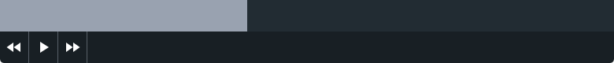

Gsap Timeline Ui
================

A timeline interface for [Gsap].

## Functionality

### UI

Gsap Ui shows the current state of your gsap timeline to help when creating animations.



### Shortcuts

  + <kbd>Spacebar</kbd> Toggle Play / Pause
  + <kbd>→</kbd> Skip forward
  + <kbd>←</kbd> Skip forward

## Setup

Pass your gsap timeline to the GsapUi:
```js
var timeline = new TimelineMax();
tl.to(timeline, 2, {
  opacity: 0,
});

new GsapUi(timline);
```

### Load with a module bundler

Install the gsap-ui package:

```unix
npm install --save-dev gsap-ui
```

Require gsap-ui with your module bundler of choice:

```js
// ES6 Modules
import GsapUi from 'gsap-ui';
```

```js
// CommonJS
var GsapUi = require('gsap-ui');
```


[Gsap]: http://greensock.com/gsap
